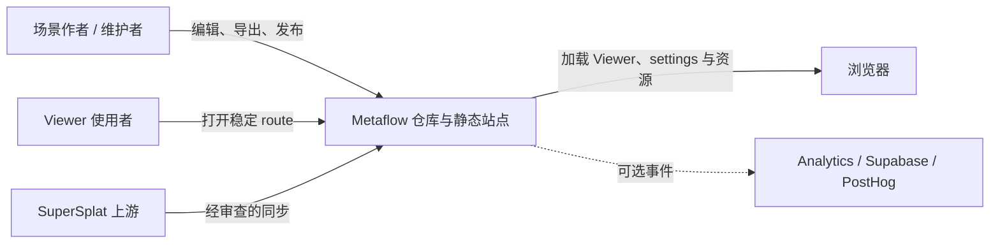
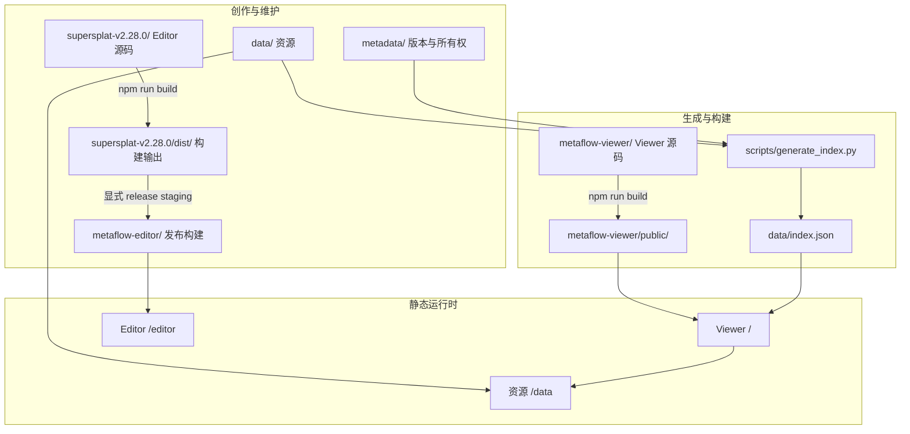

# 整体架构

Metaflow 是单仓库、静态交付为主的系统。Editor 生成模型与体验配置；资源生成器建立索引；Viewer 在浏览器中解析 route 并加载静态文件；Netlify 构建把这些部分组合成发布目录。

## 系统上下文

核心产品链路只依赖仓库静态产物与浏览器；虚线观测链路不是加载成功的前置条件。上游代码也不会自动进入当前产品，必须经过同步 Change。

## 容器关系

## 源码、生成物与事实源

- `supersplat-v2.28.0/` 是 Editor 源码；`npm run build` 只写入其 `dist/`。发布者必须显式把干净 dist 暂存到 `metaflow-editor/`，Netlify 才会把这个 tracked 部署镜像复制到 `/editor`。
- `metaflow-viewer/src/` 是 Viewer 源码；`public/`、`dist/` 是构建产物。
- `metadata/*-version-history.json` 是版本源；`data/*-version-history.json` 是浏览器可读镜像。
- `data/` 的资源目录和生成规则共同决定 `data/index.json`；index 不应成为手工维护的第二套资源事实。
- `netlify.toml` 定义如何把 Viewer、data 和 Editor 组合为静态站点。

## 运行时边界

Viewer 首先处理 route/query，然后读取 index、settings 与模型。它不需要服务端业务 API 才能展示资源。Analytics 与 Supabase 是可选的观测链路，不是资源加载成功的前置条件。

Editor 同样是浏览器应用。发布到 `/editor` 的 bundle 可以独立运行，但要改变行为必须回到版本化源码目录实现和重建。

具体 staging 与 Netlify 顺序见 [部署](../maintenance/deployment.md)。

## 仓库治理边界

`metadata/components.json` 定义路径所有权，`metadata/ci-routing.json` 定义建议检查路由。文档、数据、Viewer、Editor、Design、Reference 和发布配置分别命中最小可信本地检查；普通 GitHub workflow 只按需手动运行，不再提供所有 Change 都必须等待的聚合 Gate。

这套边界让文档更改不必构建产品，也让数据、依赖或公共行为变化不能伪装成纯文档。实际执行的命令、结果和未运行项由 PR、Issue 或直接提交交付记录。
