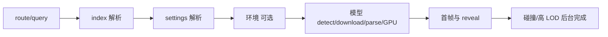

# 资源加载链路

理解加载顺序有助于判断错误发生在 route、index、资源文件、settings 还是渲染阶段。

## Route 模式

1. 浏览器打开非根路径，例如 `/acg/yzx/yzx`。
2. Viewer 以 `cache: no-store` 请求 `/data/index.json`。
3. pathname 经过标准化和 URL 解码后，与 `resources[].route` 或 `aliases[]` 匹配。
4. Viewer 从 `files` 选择模型、settings、thumbnail、environment、voxel/collision。
5. 显式 URL 参数可以优先提供 poster、环境、碰撞、voxel 等地址；`settings` 与 `content` 具有不同规则。
6. Viewer 解析 settings，创建渲染设备并进入模型加载阶段。

index 本身使用重新验证策略，因为 route 可以独立于大型资产变化；模型和 data 资源通常使用长期 immutable cache。

## 直接参数模式

当 URL 提供 `content` 时，Viewer 会跳过整个 route/index 查找，而不只是替换主体模型：

```text
/?content=/data/model.sog&settings=/data/settings.json
```

没有 `content` 时回退到 `./scene.compressed.ply`；没有 `settings` 时回退到 `./settings.json`。因此根路径黑屏时，Network 中出现这两个回退文件的 404 往往意味着 URL 没有命中 route，也没有提供直接参数。

route/query 的实际优先级并不统一：route 命中会覆盖 query `settings`，而 query `content` 会让 route settings、viewer 策略和资源元数据都不再读取。完整矩阵见 [Viewer URL 参数](../reference/viewer-url-parameters.md#实际-routequery-优先级)。

## Settings 兼容层

页面先按 JSONC 兼容规则去除注释和尾逗号，再交给 Viewer：

- 没有 `version`：按旧 v1 校验并迁移；
- `version: 2`：按当前 v2 使用；
- 其他版本：拒绝并报错。

部分历史 v2 只写了 `{ "enabled": false }` 的后处理对象，当前兼容层会补齐默认字段。新配置仍应输出完整 v2。

字段、v1/v2 边界和当前 Editor annotation 限制见 [Viewer settings schema](../reference/viewer-settings-schema.md)。

## 模型与环境

Viewer 由主体入口身份选择 PlayCanvas parser，JSON 结构只验证已选格式：

| 主体入口 | parser / 内部来源 | `State.loadingMode` |
|---|---|---|
| basename 恰为 `lod-meta.json` | GSplat octree / `streaming-lod` | `streaming-json` |
| `.sog` | SOG bundle / `sog-bundle` | `legacy-sog` |
| 其他 `.json`（包括 `meta.json`） | loose SOG metadata / `sog-meta` | `legacy-sog` |
| `.ply`（包括 compressed PLY） | PLY / `ply` | `legacy-sog` |

不支持的入口会在加载前明确失败。`lod-meta.json` 会检查 LOD 层数、filenames、根 bounds、递归 tree、leaf、file index、offset/count；验证失败不会换用另一个 parser 猜测。环境模型独立加载，失败不应让主模型永久不可见。

“Viewer 能加载”不等于“index 生成器会发布为 route”。独立 compressed PLY 与 loose SOG `meta.json` 可用 direct `content` 或既有明确入口加载；当前生成器只把 SOG 或 `lod-meta.json` 选为稳定 route 主模型，并把特定命名的 compressed PLY 作为 environment。

资源 index 的 `files.model` 是首选入口；存在 `files.lod` 时，页面选择第一个有效 LOD 文件作为兼容入口。生成器负责让这些字段与真实文件一致。

当前 `files.model` 也是 route 的唯一运行时来源权威。文件扫描不会把已有 SOG route 静默切到旁边的 `lod-meta.json`。未来 streaming/highest-quality 切换要在独立数据标签 Change 中同时解决来源元数据、旧主体释放、相机/动画连续性、environment/collision、首帧遮罩、失败回退与移动端内存峰值。

顶层主体和 environment prefetch 对网络错误、`408`、`425`、`429` 与 `5xx` 共尝试 4 次，三次等待为 `500ms`、`1000ms`、`2000ms`；其他永久 `4xx` 只请求一次。第四次失败后主体进入可操作的终态错误 UI，environment 则保持非阻塞。此策略不扩展到 streaming child fragment、voxel tile、settings 或 Analytics，也不等于 PlayCanvas loader queue slot 修复；本轮没有新增单次请求 timeout 或 `Retry-After` 处理。

## 碰撞与行走

- `voxelManifest`：tiled voxel，按位置加载分块；
- `voxel`：单体 voxel；
- `collision`：GLB 网格或兼容 voxel 地址。

碰撞资源可以延迟到首帧之后加载，避免阻塞场景出现。`viewer.voxelCoordinateSpace` 解决历史资源坐标系差异；不要在未知情况下删除它。

## 加载阶段与排查入口



route 404 看 index；settings 错误看 schema；download 失败看资源路径/LFS；首帧之后交互异常再看碰撞、相机和动画。具体症状见 [故障排查](../maintenance/troubleshooting.md)。
