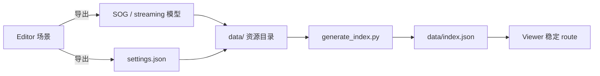

# 从 Editor 到 Viewer

这条流程适用于“在 Editor 中完成场景配置，然后把模型与展示配置纳入 Metaflow 稳定路由”。



Editor 负责创作和导出；生成器负责公开 route。自包含 HTML/ZIP、独立 compressed PLY 与平台 index 是不同契约，不能用“Editor 能打开或导出”推断“生成器一定会发布”。

## 1. 在 Editor 中准备场景

从 `supersplat-v2.28.0/` 启动 Editor，导入源模型，完成裁剪、朝向、颜色、相机姿态和动画。当前 Editor export 固定写入空 `annotations`，不能把标注作为已支持的创作或往返步骤；需要标注时按 [settings schema 的限制说明](../reference/viewer-settings-schema.md#标注及当前-editor-限制) 单独维护。

导出前至少检查：

- 主体坐标与朝向正确；
- 初始相机不会落在模型内部；
- 动画帧率、loop mode 与 start mode 符合预期；
- 背景与后处理不会依赖本机绝对路径；
- 导出“全部”还是“选中对象”已经确认。

## 2. 选择导出物

面向 Metaflow 路由，推荐分别导出：

1. 模型：使用 SOG，或已经由现有流水线生成并验证的 streaming `lod-meta.json`。`meta.json` 是 loose SOG metadata，不是 streamed LOD manifest。
2. Viewer 配置：在 Viewer 导出类型中选择 `settings.json`。

Viewer 能通过显式 `content` 直接加载 compressed PLY 或 loose SOG `meta.json`，`Metaflow legacy ZIP` 也固定包含 `scene.compressed.ply`；但当前 `generate_index.py` 不会把它们识别为稳定 route 主模型。生成器只把符合命名规则的 compressed PLY 用作 environment。完整边界见 [资源索引 schema](../reference/resource-index.md#可索引模型边界) 和 [Editor 导出契约](../reference/editor-export-contract.md)。

## 3. 放入资源目录

沿用现有分类和子分类，例如：

```text
data/ACG/FireflyFes38/<资源文件夹>/
├── <资源名>.sog
├── <资源名>_environment.compressed.ply   # 可选
├── settings.json                         # 或明确的 settings-*.json
└── loading.jpg                           # 可选
```

不要把本机绝对路径写进 settings 或 index。大于仓库阈值的资源是否进入 Git LFS，由 `.gitattributes` 的精确规则决定；不要擅自把整个 `data/**` 改成 LFS。

## 4. 生成索引

在仓库根运行：

```bash
python3 scripts/generate_index.py
python3 scripts/validate_data.py --check-files
```

生成器扫描资源目录、选取模型/settings/缩略图/环境/voxel，应用脚本中的 slug、route alias 和特例映射，然后重写 `data/index.json`。不要手工修改生成结果来掩盖目录或规则错误。

若资源需要稳定标题、slug、alias、体验类型或特殊 Viewer 策略，在 `scripts/generate_index.py` 的对应声明区增加明确规则，并接受 data + Viewer 路线检查。

## 5. 本地验证

按 [Viewer 快速开始](../getting-started/viewer.md#用-spa-fallback-启动) 分别启动 watch 和带 `-s` 的静态服务器。不要只运行当前 `npm run develop` 后访问深层 route；它没有 SPA fallback。

确认 `metaflow-viewer/public/data` 是指向仓库根 `data/` 的本地链接，或已同步为当前副本；否则刚生成的 index 与资源不会出现在本地静态服务器中。

然后访问 index 生成的 route。检查：

- route/alias 能命中唯一资源；
- 模型、settings、缩略图与环境没有 404；
- 初始相机、动画和碰撞策略与 Editor 预期一致；手工标注按独立 settings 源验证；
- 直接 `?content=...&settings=...` 与稳定 route 的表现没有意外差异。

## 6. 准备发布证据

资源或行为发布需要同步 Viewer Version History 与 Ledger。`5.18.1` 已进入完整 SemVer，当前生产稳定版为 `5.19.1 / 534b013`；后续真实资源或兼容修复从 `5.19.2` 起递增 PATCH。提交前记录 route、变更类型、验证范围和未运行检查。版本记录见 [版本与发布](../maintenance/versioning-and-release.md)，静态交付见 [部署](../maintenance/deployment.md)。
