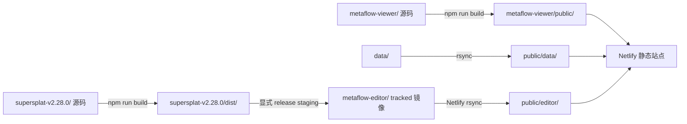

# 部署

本页说明 Viewer、data 和 Editor 部署镜像怎样进入 Netlify publish 目录。版本何时提升、Ledger 与 Version History 怎样更新，见 [版本与发布](versioning-and-release.md)。

## 当前静态交付结构

`netlify.toml` 以 `metaflow-viewer/` 为 base，publish 目录是 `metaflow-viewer/public/`：



关键边界：Netlify 构建 **不会构建 Editor 源码，也不会读取 `supersplat-v2.28.0/dist/`**。它只把仓库已经跟踪的 `metaflow-editor/` 复制到 `public/editor/`。只运行 Editor `npm run build` 后直接部署，会发布旧镜像。

## Netlify build 顺序

当前命令依次：

1. 运行 MCL legacy/平台配置校验；
2. 在 Viewer package 执行 `npm ci`；
3. 运行 `scripts/generate_index.py`；
4. 构建 Viewer 到 `public/`；
5. 把仓库 `data/` 同步到 `public/data/`；
6. 把 tracked `metaflow-editor/` 同步到 `public/editor/`。

因此 Viewer/data 发布前要检查生成 diff；Editor 发布前要先完成下一节的 tracked mirror staging。

## Editor release staging

只在明确的 Editor 发布范围中执行。使用干净 worktree，先更新 `metadata/editor-version-history.json`，再构建和同步：

```bash
cd supersplat-v2.28.0
npm ci
npm run lint
npm run build
cd ..

# 先预览将新增、替换和删除的部署文件
rsync -an --delete --exclude version.json supersplat-v2.28.0/dist/ metaflow-editor/

# 确认预览后，更新 tracked 部署镜像；保留由版本生成器维护的 runtime 文件
rsync -a --delete --exclude version.json supersplat-v2.28.0/dist/ metaflow-editor/
python3 scripts/generate_editor_version.py
```

随后检查：

```bash
git diff -- metaflow-editor metadata/editor-version-history.json data/editor-version-history.json
node --test metaflow-viewer/tests/editor-version-history.test.mjs
python3 scripts/validate_platform.py
git diff --check
```

`rsync --delete` 会删除新 dist 不再产生的旧 hashed asset；这正是避免 service worker 或 HTML 引用陈旧 bundle 的原因，但必须先看 dry-run 和 tracked diff。`version.json` 由 `generate_editor_version.py` 从 metadata 生成，不能手工从旧镜像复制。

## Redirect 与 cache

- `/data/*`、`/assets/*`、`/editor/*` 先按静态文件处理；
- 最后的 `/*` 回退到 Viewer `index.html`，提供 SPA route；
- `/data/index.json` 使用 `max-age=0, must-revalidate`；
- 大型 data 和 Editor static 使用长期 immutable cache；
- SOG/PLY 设置二进制 content type 与长期 cache。

稳定 route 可以保持不变，但大型资源名应尽量不可变。覆盖同路径资源时必须评估旧客户端和 CDN cache；优先让 route 指向新文件名。

## Preview、正式发布和 smoke

普通 PR 或 main 合并不自动证明生产发布完成。需要生产变更时，交付记录应区分：

- build 是否成功；
- preview deploy 是否可访问；
- production 是否被明确授权并指向目标 commit；
- smoke 是否检查 Viewer route、`/data/index.json`、`/editor` 和关键静态资源；
- 是否进入观察或需要回滚。

受控 release workflow 要求与组件匹配的 namespaced tag 和受治理 Change；只有显式 production promotion 才能触发外部发布副作用。文档、研究和未公开 staging 不手动触发部署。

Viewer `5.19.1` 起，Netlify 的正常触发边界是：普通 Git `main` push 由 `[build].ignore` 跳过，PR/feature branch 保留 Deploy Preview，正式 production 由 GitHub `production` Environment 内的 controlled release path 触发。`viewer-v5.19.0` 的 prepare 在 deployment 前失败，因此没有生产 deploy 或 GitHub Release。`viewer-v5.19.1` 的 D2 controlled Prepare 已通过；由于真实 F/D2 Git jobs 均停滞且没有得到远端 skipped 证据，二者被精确取消，随后按用户授权从 clean detached D2 使用 CLI/API fallback 发布 deploy `6a7efc396f36c800cfa0702e`。该 deploy 的真实字段为 `deploy_source=api`、`commit_ref=null`；身份由 main/Tag=D2、detached tree、摘要、在线 `5.19.1 / 534b013`、smoke 和观察共同证明。此 fallback 不是今后任意手工上传的默认授权。

## 回滚

托管 rollback 必须指定已成功 deploy ID、原因和明确确认，恢复后重新核对 production 指向与关键 route。回滚不会重写原 Version History 或 Ledger；应追加回滚记录和跟进 Change。

若只是 tracked 镜像有误而尚未生产发布，优先修正或 revert PR，不把“重新 build 成功”当成已经恢复线上。
