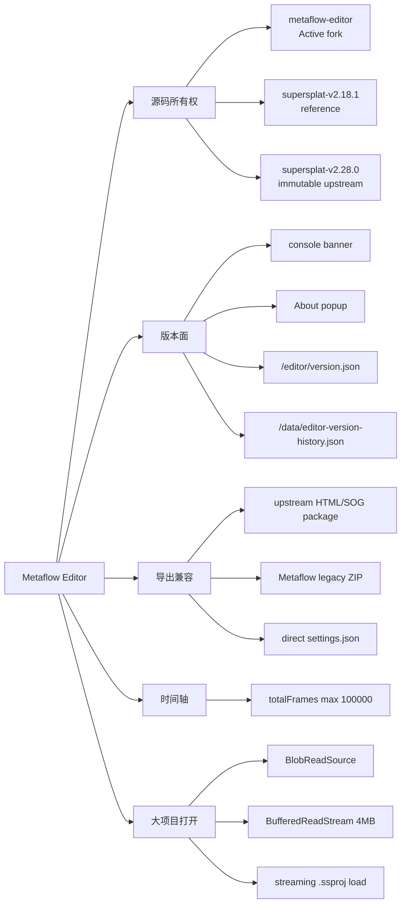
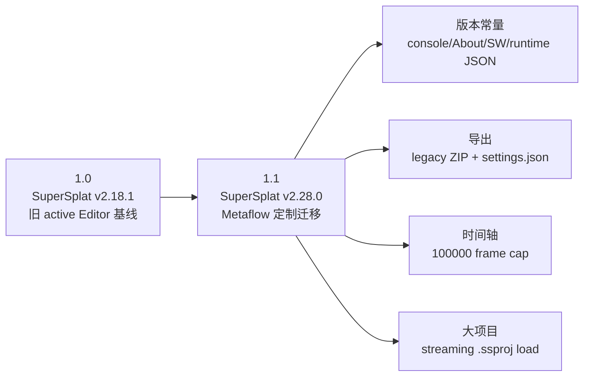

# Metaflow Editor 变更总账

本文档记录 Metaflow Editor 相对 upstream SuperSplat Editor 的同步点、源码级定制和导出兼容策略。结构化版本号的权威来源是 [`metadata/editor-version-history.json`](../metadata/editor-version-history.json)，公开生成物是 [`data/editor-version-history.json`](../data/editor-version-history.json) 与 `/editor/version.json`。

它不是 upstream changelog 的重排，而是用于回答：

- 当次同步基于哪个 SuperSplat Editor 版本；
- Metaflow 保留或新增了哪些源码级行为；
- `/editor`、导出包、直接 `settings.json` 和长动画编辑的用户结果是什么；
- 下次 upstream 合并时哪些文件必须重新核对。

当前操作入口见 [Editor 快速开始](getting-started/editor.md)，稳定导出行为见 [Editor 导出契约](reference/editor-export-contract.md)。总账保留每个阶段的版本事实，不把历史值改写为当前值。

## 审计规则

| 字段 | 含义 |
|---|---|
| 动机 / 原行为 | 版本要解决的问题，以及修改前用户能观察到的状态 |
| 上游基线 | 同步到的 SuperSplat Editor tag、commit 和关键依赖 |
| 具体改动 / 实现 | 从源码、构建产物、生成数据和测试归纳出的实现事实 |
| 用户结果 | 在线 `/editor`、导出包、直接 settings JSON 或项目打开行为的实际变化 |
| 风险 / 后续 | 下次上游同步时需要重新核对的兼容边界 |
| 证据 | 活动源码、登记的上游快照、可重建构建产物、生成数据和测试入口 |

功能、同步和发布版本必须同时更新结构化历史与本总账。纯文档维护不单独形成 Editor 产品版本。

## 能力树

## 上游同步链

## 版本记录

| 版本 | 动机与原行为 | 上游基线 | 具体改动与实现 | 用户结果 | 风险、后续与证据 |
|---|---|---|---|---|---|
| `1.0` | 保留旧 active Editor 作为可审计基线；此前只有本地备份目录，不符合 viewer 的版本化源码目录习惯。 | SuperSplat Editor `v2.18.1`；`@playcanvas/splat-transform 1.2.0`、`@playcanvas/pcui 5.5.0`、`playcanvas 2.15.3`。 | 将旧源码基线命名为 `supersplat-v2.18.1/`，只保留源码、配置、lockfile、静态资源和 README；移除本机 `.git/`、`node_modules/`、`dist/`。 | 维护者可以像查看 `supersplat-viewer-v*` 一样直接打开旧 Editor 基线，用于对比和回退判断。 | 该版本不是当前线上运行版本，时间轴仍是 upstream `10000` 上限；证据为 `supersplat-v2.18.1/` 和 `metadata/editor-version-history.json` 的 `1.0` entry。 |
| `1.1` | 旧 `/editor` 缺少 v2.28.0 的大项目打开改进，且 Metaflow 的导出、长时间轴和版本面需要在源码层保留。 | SuperSplat Editor `v2.28.0` / `9f4dfe1`；`@playcanvas/splat-transform 2.5.1`、`@playcanvas/supersplat-viewer 1.26.3`、`@playcanvas/pcui 6.1.4`、`playcanvas 2.19.2`。 | 将 active 源码命名为 `supersplat-v2.28.0/`；新增 `src/metaflow-editor-version.ts`；console/About/SW/runtime JSON 显示 `Metaflow Editor 1.1`；`src/ui/timeline-panel.ts` 保持 `100000`；`src/ui/export-popup.ts`、`src/file-handler.ts`、`src/splat-serialize.ts` 保留 upstream HTML/SOG package，同时增加 legacy ZIP 和直接 `settings.json`。 | `/editor` 对外显示 Metaflow Editor 1.1；用户可继续导出包含 `settings.json` 和 `scene.compressed.ply` 的 legacy ZIP，也可直接导出 `settings.json`；大 `.ssproj` 打开路径保留 upstream streaming 读取能力。 | 下次 upstream 合并必须复核 `splat-serialize.ts`、`file-handler.ts`、`export-popup.ts`、`timeline-panel.ts`、`sw.ts`、`metaflow-editor-version.ts`；大 `.ssproj` 保存后重开测试本轮仍未作为自动化覆盖。证据为 `supersplat-v2.28.0/`、`metaflow-editor/`、`metaflow-viewer/tests/editor-version-history.test.mjs`。 |

## 源码所有权迁移（MF-21，版本不变）

MF-21 不发布新 Editor 版本，也不重写上表 `1.1` 在 commit `aa4c35f` 时的路径事实。它把当前定制源码无损迁移到 `metaflow-editor/`，删除受版本控制的旧编译产物，并把 `supersplat-v2.28.0/` 恢复为官方 tag `v2.28.0` 的不可变快照。

当前维护约束如下：

- `metaflow-editor/` 是唯一活动源码、构建、依赖更新和 release 输入；`dist/` 由 CI、Release 或 Netlify 现场生成。
- `supersplat-v2.28.0/` 只用于 provenance 和差异审计，其 tag object、commit、tree、232 个文件及规范化摘要由 `metadata/reference-snapshots.json` 和校验器固定。
- `metadata/editor-version-history.json` 的 `current` 指向活动源码和上游快照；既有 `entries` 保留原路径和 Git ref。
- 迁移前后的 26 个非 source-map 运行时文件按 SHA-256 逐项比较；`version.json` 由结构化元数据在构建后生成。

## 固定检查清单

- `metaflow-editor/src/metaflow-editor-version.ts` 是运行时版本标签、console banner 和 service worker cache name 的源码入口。
- `metadata/editor-version-history.json` 是 Editor 版本历史源；运行 `python3 scripts/generate_editor_version.py` 后必须生成匹配的 `data/editor-version-history.json` 和 `metaflow-editor/dist/version.json`。
- `metaflow-editor/src/ui/timeline-panel.ts` 的 `totalFrames.max` 必须保持 `100000`。
- `metaflow-editor/src/splat-serialize.ts` 必须同时保留 `html`、`zip`、`legacyZip`、`settingsJson` 四种 viewer 导出路径。
- legacy ZIP 必须包含 `index.html`、`index.css`、`index.js`、`settings.json`、`scene.compressed.ply`。
- upstream 大项目打开优化保留在 `metaflow-editor/src/doc.ts` 和 `metaflow-editor/src/io/read/file-systems.ts`；下次同步需要补大 `.ssproj` 保存后重开验证。
