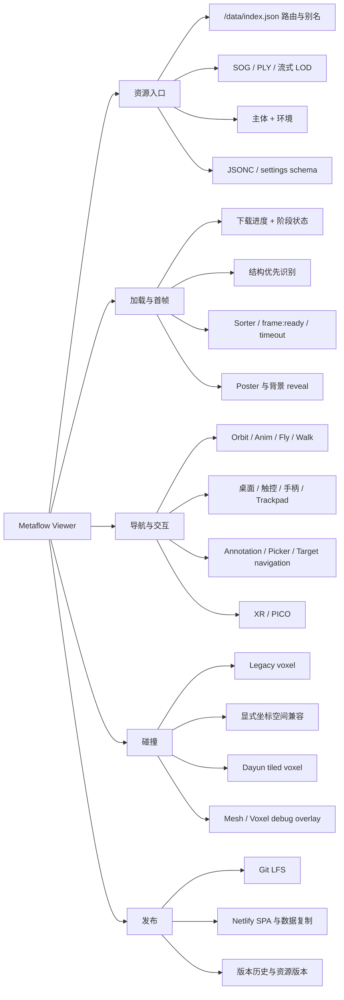
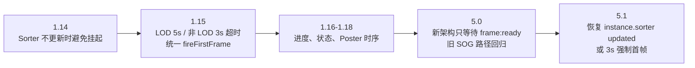
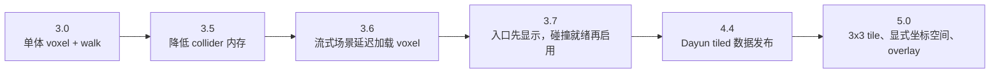
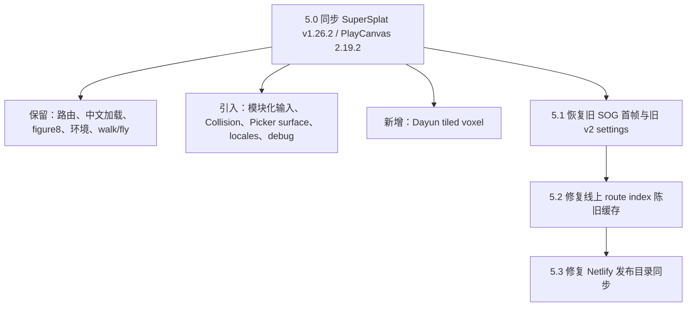

# Metaflow Viewer 逐提交详细变更总账

本文档审计 `main` 从初始提交到 `e68d52b` 的产品提交，并单独记录不产生产品版本的维护提交。它不是提交标题的重排，而是用于回答：

- 当时为什么改；
- 改动前用户看到什么；
- 代码、数据或部署结构具体怎样变化；
- 用户可见结果、兼容风险和后续修正是什么；
- 某项 Metaflow 定制能力经过哪些提交形成、回归和恢复。

结构化版本号的权威来源仍是 [`metadata/version-history.json`](../metadata/version-history.json)。本文档是面向维护者的行为审计层。

## 审计规则

| 字段 | 含义 |
|---|---|
| 动机 / 原行为 | 提交要解决的问题，以及修改前的可观察状态 |
| 具体改动 / 实现 | 从真实 diff、提交说明和关联文件归纳出的实现事实 |
| 用户结果 | 页面、交互、加载、资源或部署层面的变化 |
| 风险 / 后续 | 兼容边界、回滚关系、后续修正和仍需保留的约束 |
| 证据 | 主要模块、数据路径或配置文件；大型资源提交使用目录模式和数量，不机械展开全部文件 |

纯文档维护提交不形成产品版本。功能、修复、资源和部署提交必须同时更新结构化历史与本总账。

## 产品能力树



## 关键演化链

### 加载首帧兜底



### 体素与行走



### 上游同步与 Metaflow 恢复



## 1.x：初始 Viewer、路由、加载体验、分享、Editor 与 XR

| 版本 / commit | 动机与原行为 | 具体改动与实现 | 用户结果 | 风险、后续与证据 |
|---|---|---|---|---|
| `1.0` · `c4fedac` | 建立可运行的 Metaflow Viewer；此前仓库没有产品基线。 | 引入 PlayCanvas Gaussian Splat viewer 全套源码、Rollup 构建、UI、相机、动画、annotation、picker、settings schema 和 XR。 | 可以本地构建并查看 Gaussian Splat 资源。 | 后续全部定制均以此为祖先；证据为 `metaflow-viewer/src/**` 初始树。 |
| `1.1` · `4529e5f` | 构建产物中的数据链接不应被 Git 当作源码。 | `.gitignore` 排除 `public/data`。 | 本地构建/服务不再污染版本状态。 | 部署仍需显式把 `data/` 放入 publish 目录；该约束最终在 `5.3` 修正。 |
| `1.1a` · `5699b22` | Viewer 需要真实场景和索引。 | 新增 `data/` 资源目录、settings、缩略图和索引；超大文件暂不直接提交。 | 路由开始能够对应真实项目资源。 | 大文件缺口促成 `1.2` Git LFS；证据为首批 91 个数据文件。 |
| `1.2` · `fc13d2c` | SOG/PLY 超过普通 Git 托管限制。 | 为 `.sog`、`.ply` 等大资源配置 Git LFS，并提交 LFS 指针。 | 大模型可跟随仓库发布。 | 后续目录级 LFS 规则多次收窄；错误规则可能导致 Netlify 得到指针而非内容。 |
| `1.3` · `d84739f` | 本地可运行但没有线上静态发布规则。 | 新增 `netlify.toml`，定义 build、publish 和 SPA fallback。 | 路由可部署至 Netlify。 | `/data/*` 必须绕过 SPA fallback；发布目录复制问题在 `3.17`、`5.3`继续修正。 |
| `1.4` · `7a7cce9` | Logo 阴影被容器裁切。 | 调整 logo 容器尺寸/overflow/阴影空间。 | 品牌图标不再出现切边。 | Logo 后续形成桌面 hover、移动端 tap 展开定制。 |
| `1.5` · `bedd346` | Poster 取错索引字段，移动端 logo 无 hover。 | 路由读取 `thumbnail` 作为 poster；增加触摸展开/收起 logo 逻辑并同步相关索引路径。 | 加载封面正确，手机可看到完整品牌字标。 | `5.0` 同步时 branding 结构曾变化，后续恢复旧展开式入口。 |
| `1.5a` · `9f66efb` | 新增 SZTU B1 场景并统一旧缩略图字段。 | 发布 `/sztu/b1-sdi-206`，更新各资源 thumbnail 路径和索引。 | 新场景可通过公共 route 打开，已有场景 poster 映射一致。 | 该 SOG 后来成为 LOD/首帧超时验证样本。 |
| `1.6` · `beb640c` | Poster 尚未加载时先显示进度，造成闪黑或界面跳变。 | 等待图片完成后再 reveal loading UI；失败/无 poster 有独立分支。 | 首次加载视觉更稳定。 | 与 `1.18` 的首次/刷新一致性共同构成 poster 时序约束。 |
| `1.7` · `4da3b00` | 分享链接缺少站点图标和社交预览，移动端 logo 交互仍不稳定。 | 加 favicon、Open Graph/微信分享 meta，修正移动端 logo tap。 | 分享卡片与品牌入口可用。 | Meta 内容在 `1.8` 继续校正。 |
| `1.8` · `40862c3` | 首版分享标签内容或顺序不适合微信抓取。 | 更新 OG/分享 meta 的字段和值。 | 微信等渠道更容易生成正确预览。 | 属于静态模板行为，后续同步 HTML 时必须保留。 |
| `1.9` · `891061f` | 中文域名需要默认指向校园主场景。 | 在 Netlify 增加“深圳技术大学.com”到 `/sztu/c2-lib` 的 host 条件重定向。 | 用户可通过中文域名直达场景。 | Punycode 初值错误，立即由 `1.10` 修复。 |
| `1.10` · `e7e152c` | 中文域名 Punycode 写错导致 host 条件无法命中。 | 更正 Netlify conditions 中的 ASCII 域名。 | 域名重定向开始实际生效。 | 仍受平台重定向环境影响，因此 `1.11` 增加客户端兜底。 |
| `1.11` · `96a4966` | 仅依赖 CDN host redirect 在部分访问链路不可靠。 | HTML 启动阶段识别 hostname，并客户端跳转至 `/sztu/c2-lib`。 | 中文域名在更多入口可达。 | 必须避免与正常 route lookup 循环冲突。 |
| `1.12` · `0582969` | 默认 UI 色彩不符合 Metaflow 品牌。 | 修改主题 accent/grip 色值。 | 控件和 loading 呈现 Metaflow 蓝色。 | `5.0` 同步时一度回到橙色，随后恢复；此提交是品牌色来源。 |
| `1.12a` · `4903104` | B1 动画时长配置错误。 | 调整 `/sztu/b1-sdi-206` settings 的动画 duration。 | 时间轴和自动播放长度与内容匹配。 | 仅资源行为，不改变 viewer。 |
| `1.12b` · `ff487e3` | B1 场景数据继续校正。 | 更新该 route 的资源/settings 条目。 | B1 展示内容与当时发布素材一致。 | 原提交信息较少，审计以单文件 diff 为准。 |
| `1.12c` · `9a15c99` | C2-Lib 色调显示不符合预期。 | 为 `/sztu/c2-lib` settings 设置 neutral tonemapping。 | 场景颜色更接近发布目标。 | Chrome WebGPU 的 shader 应用问题在 `1.20` 修复。 |
| `1.13` · `2e002e8` | Tonemapping 和 loading bar 颜色未按 Metaflow 预期工作。 | 修正相机/渲染设置的 tonemapping 应用，同时调整 loading bar。 | 场景色彩与品牌 loading 更一致。 | WGSL 路径仍缺失，见 `1.20`。 |
| `1.14` · `27d8f21` | Sorter 不发 update 时加载永久等待。 | 重写 `viewer.ts` 首帧等待：监听 sorter，处理无 sorter/无 update 分支，避免只靠单一事件。 | 一部分“模型已下载但一直不出首帧”的场景恢复。 | 仍存在 LOD 与外部域名下 100% 卡住，`1.15` 加明确超时。 |
| `1.14a` · `eccf894` | Wanderer 场景构图/动画或 settings 需要更新。 | 更新 `/acg/j04/wanderer` JSON。 | 路由使用新的展示参数。 | 纯资源更新。 |
| `1.15` · `8248c72` | LOD `frame:ready` 或非 LOD sorter 事件可能永不触发。 | 统一 `fireFirstFrame` guard；LOD 5 秒、普通 sorter 3 秒超时；成功事件与超时共享完成路径。 | 外部域名和特定 SOG 不再停在 100%。 | 这是关键 Metaflow 兼容能力；`5.0` 合并遗漏后由 `5.1` 恢复。 |
| `1.16` · `7c8c7b0` | 下载完成显示 100%，但 GPU/LOD/排序尚未完成，用户误以为卡死。 | 下载进度封顶 99%；新增 `loadingStatus`；覆盖初始化、环境、下载、排序、LOD、完成阶段；首帧才设 100%。 | 加载过程开始表达真实阶段。 | 后续 2.x 将状态结构化为 `loadingStage`。 |
| `1.17` · `91c0dbe` | 状态文案出现时机和窄屏进度条宽度不稳定。 | 调整 loading status 更新顺序与 responsive CSS。 | 手机和桌面加载条更稳定。 | 与后续中文 locale 合并时需保留布局约束。 |
| `1.18` · `131f6fe` | 首次访问和刷新时，poster/loading reveal 顺序不同。 | `loadingWrap` 初始隐藏；poster load 后才显示，缺少 poster 时立即显示。 | 首次加载与刷新体验一致。 | `5.0` 新 loading 状态机仍需遵守“场景背景/Poster 不提前暴露”。 |
| `1.19` · `42d3cc9` | 长资源 URL 不适合分享。 | 在 index/启动逻辑中加入短 route alias 匹配。 | 可用简短路径访问资源。 | `1.21`、`1.22`继续修 route 匹配与诊断。 |
| `1.20` · `23c8590` | Chrome WebGPU/WGSL 下 tonemapping 设置没有作用。 | 为 Gaussian splat 输出补 WGSL shader chunk，使 WebGPU 路径执行同等色调映射。 | Chrome WebGPU 与 WebGL 颜色趋于一致。 | Shader chunk 与 PlayCanvas 版本耦合，架构升级时必须复测。 |
| `1.21` · `7704288` | 首版短路由仍有匹配失败。 | 调整 route normalization/matching 条件。 | 更多短链接可解析到资源。 | 问题仍难定位，`1.22`增加日志。 |
| `1.22` · `bdc0b0d` | route 失败时缺少可观察证据。 | 输出 pathname、normalized path、候选项和命中结果。 | 开发者可定位 alias/编码问题。 | 调试日志不是最终用户功能，应避免长期噪音。 |
| `1.23` · `8818648` | 加载卡住时无法判断停在下载、解析、排序还是首帧。 | 在 index/viewer 增加加载流程日志和关键事件输出。 | 线上问题可通过 console 分段定位。 | 后续结构化 loading stage 取代散乱日志。 |
| `1.24` · `6fb5e21` | 浏览器缓存命中时 progress 立即跳到 99%。 | 缓存路径改用 indeterminate/阶段状态，避免把不可测阶段伪装为下载进度。 | 缓存加载不再表现为“瞬间 99% 后长时间不动”。 | `1.25`扩展全阶段 UX。 |
| `1.25` · `0ebfa6e` | 状态只覆盖少数阶段，缓存和后处理仍缺少反馈。 | 扩充阶段文案、indeterminate 动画和 progress/status 联动。 | 用户能看到从初始化到首帧的连续反馈。 | 为 2.x 的结构化状态模型提供行为基线。 |
| `1.26` · `ed33854` | 累积的 listener、计时器、渲染循环和资源清理造成内存/性能问题。 | 清理事件绑定、避免重复工作、修正若干状态 bug，并优化渲染/加载生命周期。 | 长时间浏览和切换时更稳定。 | 跨 7 个文件的大修，需以回归测试而非标题判断影响。 |
| `1.27` · `7ff7cf7` | 用户不知道资源规模和 LOD 数量。 | 在 loading UI 增加文件大小、splat 数、LOD 文件数量统计。 | 大场景加载预期更透明。 | 统计必须区分已知总量与流式未知量。 |
| `1.28` · `cdbe7b1` | 缓存加载仍缺少字节、PLY 完成点和耗时反馈。 | 增加 byte counter、PLY milestone、elapsed timer，并调整 UI。 | 缓存与网络加载都能看到过程。 | 后续 UI 重构应保留信息语义而非具体 DOM。 |
| `1.29` · `f7dc54c` | 仓库只有 viewer，缺少在线编辑能力。 | 引入完整 `metaflow-editor/`，新增 `/editor` 路由和 Netlify 发布规则。 | 用户可从同站点访问 Editor。 | Editor 与 Viewer 所有权边界需保持，本轮同步不应覆盖 Editor。 |
| `1.30` · `c7bb69e` | Editor 动画最大帧数 10000 不够。 | 将打包代码中的 `totalFrames` max 提高到 100000。 | 可编辑更长动画。 | 直接修改产物可维护性较低，未来应回到源配置。 |
| `1.31` · `26597f6` | PICO 4 的 VR/AR 控制与 WebXR 参数不足。 | 扩展 XR optional features、手柄轴 fallback、controller ray/导航和 PICO 兼容逻辑。 | PICO 设备可进入 XR 并操作。 | 这是 Metaflow XR 定制核心，`5.0` 同步时需移植而非删除。 |
| `1.32` · `74c8532` | PICO 直接加载高质量资源压力过大。 | 识别 PICO 并尝试自动切换 LOD 模型。 | 头显加载更轻。 | 自动探测引入网络请求和挂起风险，随后回滚。 |
| `1.33` · `85f1f6b` | PICO LOD 的 HEAD 探测可能无响应。 | 为 HEAD 请求增加 timeout/abort。 | 理论上避免探测永久等待。 | 行为仍不可靠，`1.34`回滚此修复。 |
| `1.34` · `1f369dd` | HEAD timeout 修复未达到稳定预期。 | 撤销 `1.33` 的 timeout 变更。 | 回到原 PICO LOD 探测行为。 | 这是显式 revert，总账必须与被撤提交成对理解。 |
| `1.35` · `5bdd61c` | PICO 自动切 LOD 整体方案风险高于收益。 | 撤销 `1.32` 的设备自动切换。 | PICO 不再被隐式改写资源 URL。 | 保留 XR 控制能力，不保留资源探测策略。 |
| `1.36` · `58e836b` | XR 摇杆旋转突兀，单双手柄语义不完整。 | 自定义 `XrVrNavigation`：平滑旋转、deadzone 曲线、双手柄左移右转、单手柄默认移动、轴 fallback。 | VR 漫游更符合 PICO 实际使用。 | 后续同步必须保留该控制语义，并与 WebGPU→WebGL XR 提示共存。 |
| `1.36a` · `9dcb514` | 发布 SZTU C4-HangPai 与 D1-UTL-107。 | 增加资源、settings、缩略图/索引和 LFS 指针。 | 新校园场景可访问。 | 纯资源发布，需关注总大小和 LFS。 |
| `1.36b` · `75f65d8` | 将当时尚未入库的资源/索引状态固化。 | 提交 4 个 data 文件的当前变化。 | 线上数据与工作区一致。 | 原提交描述粗糙，总账以真实 diff 为准，不推断额外功能。 |

## 2.x：LOD 迁移、结构识别、状态机与上游 v1.18 对齐

| 版本 / commit | 动机与原行为 | 具体改动与实现 | 用户结果 | 风险、后续与证据 |
|---|---|---|---|---|
| `2.0` · `608423e` | 开始把旧 viewer 向新 LOD 架构迁移，但目录和版本标识不清。 | 调整目录文档与版本标记，建立迁移批次边界。 | 暂无直接 UI 变化，维护者获得迁移基线。 | 文档提交为后续代码批次提供约束。 |
| `2.1` · `b94f4a2` | `loadingStatus` 字符串无法稳定表达两种加载路径。 | 新增 `loadingMode`、`loadingStage` 等状态；传统 SOG 与 streaming JSON 分别上报阶段，同时保留 progress/status 双通道。 | 加载 UI 可说明当前采用哪条路径。 | 状态枚举成为本地化和诊断公共接口。 |
| `2.2` · `9267e27` | 仅靠文件名判断流式结构会误判。 | 先解析 JSON 结构字段，再结合文件名；发现不一致时立即报告。 | 正确格式更早走正确加载器。 | 冲突决策尚未进入可观察 state，见 `2.3`。 |
| `2.3` · `670afd3` | 结构/文件名冲突只在 console，用户看不到。 | 新增 `loadingConflict`，状态文案加 `[冲突]` 前缀并保持结构优先。 | 迁移异常在加载界面可见。 | 不应把冲突当 fatal；仍继续按结构路径加载。 |
| `2.4` · `429261e` | 迁移缺少可重复验收标准。 | 新增迁移验证矩阵、传统 SOG/流式 JSON/主体环境/冲突四场景和人工确认流程。 | 发布前有明确检查项。 | 文档中的首帧与超时要求后来证明必须长期保留。 |
| `2.5` · `aaea6ac` | 声明“结构优先”但实际分支仍可能被文件名抢先命中。 | 修正判定顺序，使结构真正成为主依据，文件名只做 fallback。 | 内容命名不规范时仍可正确加载。 | 结构字段检测需收紧，见 `2.8`。 |
| `2.6` · `617c475` | 空闲时持续强制渲染浪费 GPU。 | 对齐 v1.18.2：4 秒无交互后停止持续渲染，有输入/状态变化再请求帧。 | 静止页面功耗降低。 | UI 也会在相近时机淡出；需要避免动画/加载被错误节流。 |
| `2.7` · `868270d` | `inputMode` 默认值固定，移动端首次布局错误。 | 按 platform 初始化为 `touch` 或 `desktop`。 | 首屏直接显示正确控制方案。 | 后续移动端模式条依赖此状态。 |
| `2.8` · `301c1d2` | 宽泛结构字段导致普通 JSON 被误认为 streaming。 | 收紧 lod/level/chunk/node/octree/meta 等组合条件。 | 传统 settings 或 manifest 不再误走流式 loader。 | 新格式扩展时需同步检测器。 |
| `2.9` · `b04c7c7` | XR 活跃时修改 retina pixel ratio 可能破坏 WebXR framebuffer。 | XR session 中跳过普通像素比更新。 | 进入/退出头显更稳定。 | 保留普通模式性能切换，XR 结束后恢复。 |
| `2.10` · `fb8ce1f` | 分批迁移后源码、参考 viewer 和依赖状态未统一。 | 大规模合并 Metaflow 与 SuperSplat 更新，覆盖 viewer、参考源码和相关数据/构建文件。 | Viewer 获得 v1.18 时代能力，同时保留既有加载语义。 | 93 文件、约 2.8 万新增行，属于高风险同步点；后续功能必须逐项验收。 |
| `2.10a` · `91b617f` | 发布 J05 新数据。 | 增加 J05 模型、settings、缩略图/索引及 LFS 资源。 | J05 场景进入公共索引。 | 大型资源提交按 route 和文件模式审计。 |
| `2.10b` · `107341a` | J05 路由过多或命名不稳定。 | 将 J05 入口简化为 beryl/ciel/navia，并同步 index/data。 | 对外 URL 更清晰。 | 删除/合并旧 route 时需考虑分享链接兼容。 |
| `2.11` · `87161a2` | ACG 角色动画中断后回到 fly，不适合围绕人物观察。 | ACG 非 scene-like route 首次取消/打断 anim 时切换 orbit。 | 用户触碰 figure/rotate 动画后自然进入环绕观察。 | itasha、ggc/gcc 等场景型资源排除；该定制在 5.x 保留。 |

## 3.x：Walk、Voxel、移动端与第一人称体验

| 版本 / commit | 动机与原行为 | 具体改动与实现 | 用户结果 | 风险、后续与证据 |
|---|---|---|---|---|
| `3.0` · `6f23d8e` | Viewer 只有 orbit/fly，不能依据场景几何行走。 | 引入 voxel collision loader、walk controller、碰撞查询、UI 模式和资源字段。 | 有 voxel 的场景可贴地行走。 | 最初是单体 voxel，内存和加载时机随后优化。 |
| `3.0a` · `88a8d3b` | Xunyangpai 需要 LOD 与碰撞数据。 | 发布 `/acg/j05/xunyangpai` 的模型、LOD、voxel 和索引资源。 | 该 route 成为 walk/voxel 真实验证场景。 | 后续保留中文旧 route alias。 |
| `3.1` · `1885474` | 流式 LOD 判断与 walk controls 合并后存在误判/状态错位。 | 调整 11 个文件的 loader 检测、collision 接入、控制状态和 UI。 | streaming 与 walk 能同时工作。 | 653/326 行的大修，需要分别验证加载与输入。 |
| `3.2` · `3679f37` | 新 walk 功能与 Metaflow 旧 UI 风格不一致。 | 对齐桌面/移动模式按钮、帮助、状态、walk controls 和样式。 | Walk 成为正式产品入口而非调试功能。 | 后续 UI 细化连续发生在 3.3–3.14。 |
| `3.3` · `350667f` | 移动端 walk UI 与 voxel 加载状态拥挤且时序不清。 | 重构模式条、加载状态、触控控件和禁用态。 | 手机端能区分“有 walk 能力”和“碰撞尚未就绪”。 | 该语义在 `3.7`明确为“可见但禁用”。 |
| `3.4` · `c82394e` | UI 合并丢失部分 Metaflow 表面，J05 缺环境资源挂载。 | 恢复 viewer UI 结构并为 J05 关联 environment。 | 品牌/控制恢复，场景环境完整。 | 23 文件跨 UI 与数据，需防止整文件回滚。 |
| `3.5` · `3f7d17d` | Voxel collider 常驻结构占用过多内存。 | 压缩/减少碰撞节点的冗余表示和临时对象。 | 大 voxel 场景更少内存压力。 | 二进制兼容字段仍需保留。 |
| `3.6` · `6f59563` | Streaming 主体首帧被 voxel 下载阻塞。 | 对流式场景延迟碰撞加载；模型先进入可视状态，碰撞后台准备。 | 首帧更快，walk 稍后可用。 | 必须保持 walk 入口状态提示，见 `3.7`。 |
| `3.7` · `119872c` | 延迟加载期间 walk 按钮消失，用户不知道场景支持行走。 | 将 capability 与 readiness 分离：有资源即显示，未加载完 disabled，完成后启用。 | Walk 可发现且不会过早进入。 | Dayun tiled 后扩展为“脚底 tile 就绪”。 |
| `3.8` · `0a391a9` | 移动端帮助 modal 超出视口或遮挡控制。 | 限制 modal 高度、滚动和安全边距。 | 小屏可查看并关闭帮助。 | Annotation nav 也必须避让 modal。 |
| `3.9` · `1a1a6be` | Orbit/fly/walk 的操作提示分散且不一致。 | 统一 camera mode hint 文案和触发条件。 | 模式切换更易理解。 | 中文 locale 合并时应保持这些语义。 |
| `3.10` · `1a80674` | 第一人称控制与 v1.18 行为差异大。 | 对齐 fly/walk 子模式、键鼠、指针锁、触控和状态切换。 | 第一人称体验更接近新版 SuperSplat。 | 7 文件、739/554 行，移动端需继续修正。 |
| `3.11` · `68bd423` | 第一人称模式胶囊尺寸/选中态不清。 | 重构模式 capsule DOM/CSS 和切换状态。 | 桌面模式条更紧凑清晰。 | 需与 walk disabled 状态兼容。 |
| `3.12` · `d8b3826` | 手机模式条和 joystick 占位、层级、形状不理想。 | 调整 mobile strip、joystick 容器、按钮布局和输入关联。 | 触控导航区域更符合拇指操作。 | 仍有触摸竞争问题，见 `3.13`、`3.15`、`3.16`。 |
| `3.13` · `a100b06` | Touch 控件细节仍有遮挡和手势误触。 | 优化尺寸、安全区、pointer/touch handling 和视觉反馈。 | 移动操作更稳定。 | 不应被上游桌面优先 UI 覆盖。 |
| `3.14` · `de6be6b` | UI 重构后动画未默认启动，桌面模式条顺序/状态偏移。 | 恢复 anim start，并调整 desktop mode strip。 | 有动画资源重新自动播放，模式入口对齐。 | 后续 figure8 策略建立在此启动语义上。 |
| `3.14a` · `8ee82ad` | 发布超大 Dayun 流式场景。 | 通过 LFS 加入约 4865 个数据文件、LOD 层级、settings、缩略图和索引。 | `/shenzhen/dayun` 可流式浏览。 | 极大资源树要求发布只传真实对象，后续 LFS/Netlify 多次修正。 |
| `3.15` · `9625034` | Dayun/新索引暴露了移动触控与扫描器边界问题。 | 加固 touch 生命周期、索引扫描过滤和资源识别。 | 手机交互与自动索引更少误判。 | 仍有并发 touch 状态，`3.16`继续稳定。 |
| `3.16` · `f90e762` | 多指/取消/模式切换后触控状态可能残留。 | 修正 touch controller、UI 与输入状态清理。 | Joystick 和相机不再容易卡住。 | 需覆盖 pointercancel、touchend 和 UI modal。 |
| `3.17` · `8bdb377` | Dayun 未完整进入 Netlify publish，LFS 规则过宽。 | 调整 deploy build 和 `.gitattributes` 范围。 | Dayun 能随站点部署，其他数据不被错误 LFS 化。 | 发布目录仍存在复制方式问题，最终由 `5.3`修复。 |
| `3.18` · `cf212b3` | 部分 settings 使用注释和尾逗号，标准 JSON.parse 失败。 | 增加 JSONC 注释剥离、尾逗号处理和 route settings 加载兼容。 | 历史 settings 无需重写即可加载。 | Parser 必须避免破坏字符串内的注释符号。 |
| `3.19` · `01c9a62` | settings 无法声明 Metaflow 场景渐变天空。 | 新增 `background.gradient` schema、CSS 背景应用和颜色/stop 配置。 | Dayun 等场景可显示三段渐变天空。 | Loading 阶段不能提前露出场景背景，5.x 已做 reveal 时序保护。 |
| `3.20` · `11b58ff` | 透明 canvas 合成到渐变背景时 splat 边缘发白。 | 调整 CameraFrame compose、透明 clear 和 alpha 合成。 | 渐变天空上的高斯边缘更自然。 | GLSL/WGSL 两条后处理路径必须同时维护。 |
| `3.20a` · `4fe0e0f` | Dayun LFS 状态与 Phoenix 发布合并后不一致。 | 恢复 Dayun 大文件 LFS 指针，同时保留 Phoenix 资源上线；涉及 787 个文件。 | 两批资源都能留在发布历史。 | 资源状态修复，不改变 viewer 行为。 |

## 4.x：动画策略、ACG 发布、版本基础设施与 Dayun Tiled 数据

| 版本 / commit | 动机与原行为 | 具体改动与实现 | 用户结果 | 风险、后续与证据 |
|---|---|---|---|---|
| `4.0` · `fac8405` | 动画/默认相机决策散落在 CameraManager，难以验证。 | 抽出 `resolve-animation-policy`、rotate/figure8 policy helper 和单元测试结构。 | 不直接改变内容，但为 route 级动画策略提供稳定接口。 | 后续 `4.1`、Firefly 和 Cyrene 都依赖此决策层。 |
| `4.0a` · `e67801c` | 发布 SZTU C1 与 FES 系列场景。 | 增加 365 个资源文件、索引项和 settings；route 包括 `/sztu/c1-bdi-206` 与 `/sztu/fes/*`。 | 新校园/活动场景上线。 | 大资源发布只通过 route pattern 记录，不逐文件抄写。 |
| `4.1` · `e3eab5b` | 无显式 animTrack 的角色场景缺少自动展示轨迹。 | 增加 synthetic figure-eight 轨迹生成与 `viewer.syntheticAnimation` 路由策略。 | 人物场景自动以 8 字轨迹展示。 | 用户交互后仍按 `2.11` 首次退出到 orbit。 |
| `4.2` · `5df187a` | 发布 FireflyFes38 ACG 数据。 | 增加 826 个模型/环境/settings/缩略图/索引文件；角色 route 使用 figure8，scene route 使用流式 LOD。 | FireflyFes38 系列可在线浏览。 | 角色与场景必须采用不同加载和相机策略。 |
| `4.2a` · `f1d95ff` | Azur Lane 需要结合视觉 settings 与动画/相机 settings。 | 生成并切换到 `settings-merged.json`，保留目标 tonemapping/背景与相机状态。 | `/acg/fireflyfes38/azur-lane` 构图和播放符合预期。 | 合并需按 schema，不应做字符串拼接。 |
| `4.2b` · `66e4311` | 增加 ACG 2568 route，并补齐 Firefly thumbnails。 | 发布 `/acg/2568/*`，更新 Firefly poster/索引。 | 新场景和分享封面可用。 | 此提交原是旧版本历史截止点。 |
| `4.3` · `8bc11d5` | Firefly Azur Lane 保留一份设置来源，同时包管理工具需要显式声明。 | 新增 `settings-f098ded9.json`；在 viewer package 增加 yarn packageManager 字段。 | 资源设置来源可追溯，开发环境工具版本更明确。 | 当前实际构建仍使用 npm/Node 20；不应把设置文件误选为线上 override。 |
| `4.4` · `e47067b` | Dayun 单体 voxel 不适合超大场景，且版本历史只有零散 commit 信息。 | 发布 `tiled-voxel/voxel-tiles.json` 与 293 个真实 tile 的 JSON/BIN 对；删除错误旧单体 voxel；扩展索引生成器；首次建立 metadata/data version history 和审计文档。 | Dayun 可按位置加载碰撞分块，线上公开 release metadata。 | Manifest 有 483 条描述但只发布真实 tile；loader 必须容忍缺失条目并按活动 3x3 管理。 |

## 5.x：SuperSplat v1.26.2 架构、兼容恢复与发布修复

### 5.0 模块变化线框

```text
旧结构                                      5.0 结构
┌────────────────────────────┐             ┌────────────────────────────┐
│ input-controller.ts 单体   │             │ input/app/*                │
│ walk-cursor.ts             │             │ input/devices/*            │
│ 单体 voxel collision       │     ->      │ collision/*                │
│ 小型 picker                │             │ nav-cursor + target nav    │
│ 散落加载文案               │             │ locales + localization     │
│ 旧 PlayCanvas 初始化       │             │ app/createGraphicsDevice   │
└────────────────────────────┘             └────────────────────────────┘
```

| 版本 / commit | 动机与原行为 | 具体改动与实现 | 用户结果 | 风险、后续与证据 |
|---|---|---|---|---|
| `5.0` · `f41f6de` | 旧 Metaflow 基于早期 SuperSplat，缺少 v1.26.2 的 collision、输入、picker、localization、debug 和新 PlayCanvas 初始化；同时必须保留路由、中文加载、动画、环境、walk/fly、XR、品牌和部署语义。 | 72 文件、约 12124/3950 行：升级 PlayCanvas 2.19.2；新增 `app.ts`、模块化 input、camera utils/spawn/sphere mover/target navigation、Collision/mesh/voxel/tiled voxel、nav cursor、mesh/voxel overlay、debug panel、GLSL+WGSL picker、locales/settings export；迁移 Dayun 3x3 tile、`nodeStride/nodeWordCount`、`voxelCoordinateSpace`；恢复蓝色主题、展开 logo、XR navigation、walk disabled gating、annotation 避让、渐变天空和线上 collision 按钮。 | 新架构可运行 Dayun tiled collision、WebGPU overlay、多输入和中文阶段文案；旧资源通过显式 `metaflow-rz180` 兼容。 | 大规模同步遗漏了旧 SOG 独立 sorter 首帧路径，Cyrene 等停在“正在准备首帧”；README 也被错误缩短。首帧由 `5.1`修复，README 由本总账维护提交恢复。 |
| `5.1` · `6558254` | 5.0 只等待 octree `frame:ready(ready=true, loading=0)`；标准 SOG 使用 instance sorter，不一定进入该事件。旧部分 v2 settings 只有 `{enabled:false}` 也被新 schema 拒绝。 | 在 settings import 边界补齐 post effects 默认结构；在 `gsplatComponent.instance` 路径监听 sorter `updated`，主动 sort，3 秒无事件则强制 schedule first frame；首帧完成统一设置 ready/progress/status 并发 `firstFrame`。同时校正部分 route model selection。 | Xunyangpai 黑屏和 Cyrene 卡在首帧的问题恢复，旧 settings 不再 fatal。 | 明确恢复 `1.14/1.15` 的兼容意图；不能用等待完整模型或删除 timeout 替代。 |
| `5.2` · `99ffe6c` | Netlify 对 `/data/*` 使用长缓存，客户端可能读到旧 index，导致新 route 找不到模型并回退黑屏。 | route 启动时以 `cache:'no-store'` 请求 `/data/index.json`；为 index 单独设置 `max-age=0, must-revalidate`，并加静态测试。 | 新部署的 route/alias 能立即被解析。 | 大模型仍可 immutable；只有 route authority index 必须重新验证。 |
| `5.3` · `7672825` | Netlify build 先删除再复制 `public/data` 时，链接/目录状态可能让新资源未进入最终 publish。 | 将数据同步改为 `mkdir -p` 后 `rsync -a --delete` 原位同步。 | 部署产物与仓库 `data/` 精确一致。 | `--delete` 只允许作用于 publish 副本，不得指向源数据目录。 |
| `5.3a` · `74c04c0` | Cyrene 初始构图和 poster 不符合最新展示要求。 | 将给定 position/angles/distance 转换为 settings 的 position/target/fov；保留 figure8；新截图居中裁为 3108×1748 16:9，并更新 index 文件大小。 | Cyrene 首帧与 figure8 从新构图开始，加载封面同步更新。 | 纯资源更新，不改变 viewer、体素或 renderer 行为。 |
| `5.4` · `23fb3ab` | 单体 voxel 再次参与首帧前的统一等待；动画退出仍依赖 ACG 路由猜测，无法区分人物、场景与用户重播动画前选择的模式；查询参数缺少完整维护文档。 | 将 legacy 单体 voxel 改为 `firstFrame` 后后台下载，并在完成后动态挂载到 InputController、CameraManager、NavCursor、Walk readiness 与 overlay；索引 schema 1.2 新增 `experienceType` 和 `viewer.animationFirstExitMode`；ACG 角色与 Dayun 首次主动退出动画进入 Orbit，后续退出恢复播放前 Orbit/Fly/Walk，Walk 不可用时回退 Fly；README 增补实际解析的资源、UI、渲染和调试参数。 | 主模型先出首帧，Walk 入口保持可见禁用并在碰撞就绪后启用；Cyrene/角色与 Dayun 首次交互进入焦点观察，用户重播动画后不再被强制改回 Orbit。 | Dayun tiled voxel 继续按脚底 tile 按需加载，不改为完整下载；五个历史 ACG 大场景显式标记为 scene；证据为 `scripts/generate_index.py`、`src/index.ts`、`src/viewer.ts`、`src/camera-manager.ts` 和策略测试。 |
| `5.5` · `f4c4621` | PlayCanvas 官方 LOD streaming 示例有 shader 级 radial reveal，但 Metaflow 首版迁移的 reveal 在 loading 遮罩下消耗时间、未覆盖 unified workbuffer 和 environment gsplat，用户刷新时难以看到效果。 | 新增 `GsplatRevealRadial`：使用 PlayCanvas 2.19 的 `gsplatModifyVS`、`modifySplatCenter`、`modifySplatRotationScale`、`modifySplatColor`，去掉 `uDotTint/uWaveTint` 与所有颜色闪色；unified 资源通过 `setWorkBufferModifier` 注入，non-unified 保留 material chunk fallback；主体与 environment entity 共同 armed；`loadingWrap.hidden` 后才开始计时；小资源按半径反推速度/加速度并 clamp delta，避免首帧露出一片或一次大 delta 跳到结束；新增 `?noreveal`。 | 所有 Gaussian Splat 资源默认从相机焦点做小点 radial reveal，环境模型不再提前完整显示；截图/排查可用 `?noreveal` 关闭。 | Reveal 是 shader 材质/工作缓冲效果，不属于 DOM loading UI，也不影响 voxel overlay、annotation 和碰撞；证据为 `src/gsplat-reveal-radial.ts`、`src/viewer.ts`、`src/index.html`、README 参数文档和静态测试。 |
| `5.6` · `1a536f1` | 5.5 线上 reveal 观感偏快：`fitMotionToMinimumDuration` 扭曲官方运动曲线，且 loading 后首帧大 `dt` 仍可能让波瞬间扫完；用户希望两波间隔更短、整体更从容。 | 移除 `fitMotionToMinimumDuration`，保留 `MAX_REVEAL_DELTA_TIME = 1/30` 的 reveal 专用 delta 钳制；将 `DEFAULT_REVEAL_SPEED/ACCELERATION` 调到 `0.75/3.5`，`DEFAULT_REVEAL_DELAY` 调到 `1.0`，让 dot/lift 两波更贴近且整体略慢。 | Cyrene 等小模型不再“嗖一下”全显，起始小点扩散更缓和，lift 波更早跟随 dot 波。 | 仅调整 reveal shader 时间与运动参数，不影响 loading UI、碰撞或 `?noreveal`；证据为 `src/gsplat-reveal-radial.ts` 与静态测试。 |
| `5.7` · `4114e8f` | 5.6 reveal 的 lift 波前局部隆起（`liftAmount * 0.9`）观感偏硬，用户希望去掉隆起、保留 dot/post-lift 的 sin 抖动，并进一步缩短两波间隔。 | 从 `modifySplatCenter` 移除 lift 波前 Y 轴隆起块；保留 `wavesActive` 的 `sin(time+phase) * 0.25` 抖动（dot 阶段与 lift 扫过后）；`DEFAULT_REVEAL_DELAY` 设为 `1.0`；`SHADER_CHUNKS_VERSION` 升到 `2.21`。 | reveal 抬升更干净，小点阶段仍有轻微起伏，lift 更早跟随；本地需 `npm run build` 后 `serve public` 才能看到 shader 变更。 | 纯 shader 行为微调；证据为 `src/gsplat-reveal-radial.ts` 与静态测试。 |
| `5.8` · `4e848ac` | 5.7 线上 reveal 点大小统一，角色 SOG、c2-lib 流式场景和 Dayun 超大体素观感失衡；Dayun 流式 LOD 在 reveal 期间 workbuffer 不持续更新导致双波断裂；取消 loading 延迟后角色 SOG 又显得过快。 | 新增 `resolveRevealDotProfile` 与 `uRevealDotSize` 分档（`characterSog` 固定 `0.00084`、`streamingScene` 按半径 `0.000066` 钳制、`megaVoxel` 按半径 `0.00022` 钳制）；`experienceType` 从 index 透传；流式 octree placement 启用 `setWorkBufferAlwaysUpdate(true)`，`fitWaveToSceneSize` 不再 cap 波半径，reveal 完成后再开高细节 LOD；恢复 `beginRevealWhenSceneVisible`（rAF + transitionend/600ms）；reveal 期间 `minPixelSize=0.5`；`SHADER_CHUNKS_VERSION` 升到 `2.24`。 | Cyrene/角色点更小、Dayun 双波连贯、c2-lib 点略缩小；loading 遮罩退场后再开始 reveal，避免“嗖一下”全显。 | 分档系数集中在 `calcRevealDotSize` 与 `viewer.ts`；证据为 `src/gsplat-reveal-radial.ts`、`src/viewer.ts`、`src/types.ts`、`tests/tiled-voxel-index.test.mjs`。 |
| `5.9` · `1d9ab2b` | 5.8 上线后 SOG/流式 reveal 仍偏快且在 loading 阶段露出点；Dayun 不宜沿用无 fitWave 的慢波；流式场景高细节 LOD 等到整段 reveal 结束才开，主体清晰过晚；远环境 PLY 阻塞首帧；c2-lib 首次退出动画未进 Orbit。 | 新增 `uRevealActive` 在播放前全隐藏 splat；SOG/流式固定 `REVEAL_PACE_SCALE=0.6` 且不再 fitWave，Dayun 保留 fitWave 后再乘 `MEGA_VOXEL_PACE_SCALE=0.85` 并同比拉长 delay；`characterSog` 点改为 `LEGACY_ONLINE_DOT×1.5`；去掉 600ms 改为单次 rAF；环境从 `Promise.all` 解耦并 `attachEntity` 补挂 reveal；`onSubjectRevealed` 在 lift 波扫完主体半径时 `openHighDetailLod`；`ANIM_FIRST_EXIT_ORBIT_ROUTES` 加入 `/sztu/c2-lib`；`SHADER_CHUNKS_VERSION` 升到 `2.25`。 | 角色 SOG 更接近 5.7 节奏且 loading 无点；Dayun 双波更从容；c1-bdi 等远环境场景主体更早变清晰；c2-lib 首次退出动画进入 Orbit。 | 高 LOD 仍为全局 `lodRange` 开关，未扫区域由 reveal shader 继续隐藏；证据为 `src/gsplat-reveal-radial.ts`、`src/viewer.ts`、`scripts/generate_index.py` 与静态测试。 |
| `5.10` · `8b37760` | 需要从只看 PV/UV 升级到可解释用户行为、加载质量、设备兼容、错误和未来多人同屏效果的分析体系；同时成本优先，不能把 15 秒心跳、loading 高频阶段和协同 cursor/camera 流全部送入 PostHog。 | 新增 `analytics/tracking-plan.json` 作为事件契约；前端加入 `createAnalyticsClient`，支持 Supabase 批量上报、`sendBeacon`/`keepalive` flush、15 秒可见心跳、`page_hidden/restored/session_summary`、首帧/加载失败/UI/设置/相机/导航/注释/全屏/XR/错误事件；引入 rrweb 低比例回放且默认 mask inputs、禁 canvas；Rollup/HTML 支持 `METAFLOW_ANALYTICS_*` 与 PostHog 配置；新增 Supabase Edge Function `analytics-collect`、`analytics.events_raw/events_rejected/replay_chunks/dim_resource`、Metabase 用事实视图和 daily rollup、service_role grant migration；PostHog 只允许镜像低频语义事件；多人同屏只预留 `collab_*` 聚合事件，不记录高频 presence payload。 | 线上可用 Supabase 作为权威数据层计算 session、page duration、engaged session、bounce、loading abandonment、设备分布和错误 Top N；Metabase 可以直接消费 fact/daily 表，不需要扫 raw JSON；未来要接 PostHog 或多人同屏时已有 sink/事件边界。 | 原始事件保留与 rollup 刷新策略仍需随流量调优；PostHog 默认未启用且只做可选镜像；`.netlify` 本地状态不进入版本；证据为 `src/analytics/client.ts`、`supabase/functions/analytics-collect/index.ts`、`supabase/migrations/20260616000000_analytics_v1.sql`、`docs/analytics-implementation.md`、`tests/analytics.test.mjs`、TypeScript 检查、Node 测试、生产 smoke 与 Supabase migration list。 |
| `5.11` · `b06b13c` | 5.10 已经打通核心行为采集，但资源维度未填充、设备只能看 viewport/DPR/语言/renderer，缺 UA/Client Hints、来源归因、阶段耗时、Web Vitals、Resource Timing、聚合交互深度和用户留存/数据质量建模。 | Tracking plan 升到 `analytics.v1.1` 并新增 `web_vitals_observed`、`resource_timing_collected`；SDK 采 UA/User-Agent Client Hints、referrer/UTM、Web Vitals、Resource Timing、heartbeat 聚合交互计数和错误 stack hash；Netlify 加 `Accept-CH`；collector 合并请求头和客户端 device context，派生 browser/os/device_class/device_model；v1.1 migration 重建 `fact_page_views` 并新增 `fact_web_vitals`、`fact_resource_timings`、`fact_resource_stage_timings`、`fact_users`、performance/user/data-quality daily rollup；资源维度同步脚本按 resource id 去重。 | Metabase 可按 browser/OS/device class/referrer/UTM/renderer 分析 page view，可看 Web Vitals、资源 timing、阶段耗时、用户新老和数据质量；`dim_resource` 已同步 58 行。 | 不记录输入文本、完整 query、高频 pointer/camera 流或完整 IP；Client Hints high entropy 仅在浏览器允许时有值；证据为 analytics 测试、typecheck、build、远端 migration list、Edge Function deploy、v1.1 smoke 查询。 |
| `5.12` · `de75ce5` | Safari/Beacon 等真实浏览器路径会以带 credentials 的跨域请求发送 analytics beacon，而 collector 只返回 `Access-Control-Allow-Origin`，导致 `Beacon API cannot load ... Access-Control-Allow-Credentials is not "true"`；同时 CSS 构建引用了不存在的 `index.css.map`，刷新时出现 sourcemap JSON parse 噪音。 | Edge Function 对允许 origin 补充 `Access-Control-Allow-Credentials: true`；SCSS 构建关闭 `sourceMap`，让生产 `index.css` 不再引用缺失 map；analytics 测试增加 credentials header 断言。 | 生产浏览器中的 analytics beacon 不再被 CORS 拦截，page/session/error 等事件可以进入 Supabase；控制台不再出现 `index.css.map` HTML 解析成 sourcemap 的 warning。 | 不改变 analytics schema、PostHog 开关或资源加载逻辑；模型/voxel 的 `网络连接已中断` 仍按资源网络问题单独排查；证据为 analytics 测试、typecheck、build、CSS tail 检查和生产 CORS smoke。 |
| `5.13` · `4031c46` | 分析看板需要通过主站固定入口访问，但 Metabase 仍应留在受登录保护的子域。 | 在 Netlify 增加 `/dashboard` 与 `/dashboard/*` 的 302 redirect；后续 dashboard 入口固定为 `https://dashboard.metaflow.shuang-su.com/metaflow/` 双语 shell，原生 Metabase dashboard 深链继续走 `/dashboard/*`。 | 主站获得稳定 dashboard 入口，不把 Metabase 静态内容并入 viewer 发布目录；内部看板可在中文/英文之间切换。 | 仍依赖 dashboard 子域的登录保护和可用性；此提交未改变 viewer runtime。 |
| `5.14` · `7c52315` | `深圳技术大学.com` 曾被改成短路径 `/c2-lib`，但后续数据整理删除了 C2-Lib 的短链 alias，导致入口无法匹配 `data/index.json` 中的 `/sztu/c2-lib`，并回退加载不存在的默认场景资源。 | 将 Netlify host redirect 与 HTML `domainRedirects` 恢复到 `/sztu/c2-lib`；在 `scripts/generate_index.py` 的 `RESOURCE_ROUTE_ALIASES` 恢复 `("sztu", None, "c2-lib"): ["/c2-lib"]`；新增 domain redirect 测试，要求中文域名目标可被索引 route/alias 匹配。 | 中文域名根路径回到 canonical C2-Lib route；已经分享出去的 `/c2-lib` 短链继续可用。 | alias 必须保留在生成脚本源头，不能只手工改 `data/index.json`；证据为新增 route invariant 测试与重新生成索引。 |
| `5.15` · `46b4ec2` | 中文域名下除 C2-Lib 外的 SZTU 资源只能通过 `/sztu/...` canonical route 打开，短路径如 `/c4-hangpai`、`/b1-sdi-206`、`/top10-26` 会落入 SPA fallback 后匹配不到资源。 | 在 `RESOURCE_ROUTE_ALIASES` 为 SZTU 资源补齐短链：`/c4-hangpai`、`/b1-sdi-206`、`/d1-utl-107`、`/c1-bdi-206`、`/top10-26`、`/fes/top10-26`，并扩展路由测试确保 canonical route 和短链都映射到同一资源。 | `深圳技术大学.com` 下所有 SZTU 资源都可用短链访问，同时保留 `/sztu/...` 正式路由和既有 `/c2-lib`。 | 短链仍由 `data/index.json` alias 解析，不新增服务端 redirect；证据为 route alias 测试与重新生成索引。 |
| `5.16` · `e68d52b` | Metabase 入口已经可访问，但首版看板仍偏“卡片堆叠”，缺少支付宝数据页那类高密度产品分析视图：今日/昨日小时对比、留存热力表、来源 Top/明细、设备画像和保守机型表；如果卡片直接堆临时 SQL 或扫 raw JSON，后续数据量上来会不稳定。 | 新增 `analytics.hourly_usage_metrics`、`daily_retention_cohorts`、`daily_acquisition_metrics`、`daily_device_model_metrics` 四个物化汇总，并纳入 `analytics.refresh_rollups()`；机型展示采用保守口径：Android 只用可靠 Client Hints model，缺失则 `Android unknown`，iOS 只显示 `iPhone`/`iPad`，desktop 按 OS/browser/renderer；重写双语 Metabase 自动化脚本，生成中英一致的 17 张卡片：关注指标、今日小时、趋势、访问详情、留存、来源、设备、资源质量、数据质量、交互、错误和需排查会话；补充 analytics 测试和文档。 | 看板可以按“我关注的数据 + 今日数据 + 趋势/来源/留存/设备/质量/诊断”回答运营问题；机型统计上线为可读但不做不可靠 iPhone 精确推断；核心卡片以事实表和汇总表为数据源，避免对 raw 事件做看板级全表扫描。 | 本轮仍使用 Metabase 原生视图，不做自研前端数据中心，也不公开分享；留存和来源口径受匿名用户 hash 与 UTM/referrer 完整度影响；证据为 v1.2 migration dry-run、analytics 单测、dashboard shell 脚本语法检查和重新生成的版本索引。 |
| `5.17` · `f371f48` | 参考支付宝数据面板后，5.16 仍缺全局筛选、指标口径说明、KPI 详情支撑、D30 留存、访问时长/时段画像、可信 raw 机型来源、机型质量排行、机型与 renderer 交叉诊断，以及 Metaflow 自身的转化目标层；仅有“机型 Top”会把访问量和兼容性问题混在一起。 | Tracking plan 升到 `analytics.v1.2`，加入 dashboard controls、conversion goals 和 device model policy；SDK 支持可信宿主通过 `window.MetaflowDeviceInfo` 注入 Alipay/WeChat/Native WebView raw model，collector 记录 `device_model_raw/source/confidence`；新增 v13/v14 Supabase 迁移：`daily_kpi_metrics`、D0-D30 `daily_retention_cohorts`、`daily_session_duration_metrics`、`daily_hourly_profile_metrics`、增强 `daily_acquisition_metrics`、含 raw/source/confidence/errors 的 `daily_device_model_metrics`、`daily_goal_conversion_metrics`、`daily_dashboard_freshness_metrics` 和 `dim_device_model`；双语 Metabase 自动化脚本新增全局参数、指标口径、数据新鲜度、访问时段/时长、留存摘要、机型明细、精确机型覆盖率、机型质量排行、机型 × Renderer、转化目标等卡片。 | 看板能像成熟产品数据面板一样从“访问概况”继续钻到来源、留存、访问深度、设备覆盖率和兼容性风险；`iPhone17,3` 这类 Apple raw identifier 只有在小程序/原生壳或可信 Client Hints 提供时入库，普通 Web 不再伪造精确 iPhone 型号。 | 暂不实现交易、搜索/收藏/消息转化、年龄/性别/省市画像，也不记录高频鼠标/相机轨迹或输入内容；当前真实数据还没有可信 iOS raw code，`exact_model_available` 全为 false 属于预期；证据为 Supabase v13/v14 远端迁移、`analytics.refresh_rollups()` 行数检查、Edge Function deploy、analytics 测试、typecheck、build 和 diff check。 |
| `5.18` · `7ce294a` | 移动端开启游戏控制后，fly 模式只有左摇杆导致用户不知道可升降，walk 模式缺少明显跳跃按钮；横屏控件相对参考站仍不够协调，Zoom/升降胶囊和摇杆底边没有统一，小屏横屏容易压近底部菜单。 | 参考 UnrealTwin 移动端横屏布局，横屏改成左 Zoom 胶囊、左移动摇杆、右环顾摇杆、右升降/跳跃控件；升降按钮改为世界空间高度移动；胶囊按下态复刻参考站的轻微下压动画；walk 跳跃改为无图标单格圆形胶囊；尺寸、间距和底部避让按视口自适应，设置/帮助等弹窗打开时隐藏触控游戏控件。 | 移动用户在游戏控制开启时能直接看到移动、环顾、Zoom、绝对升降和跳跃入口；横屏控件左右更均衡，小屏/平板布局更稳，关闭游戏控制、切到 orbit/anim 或打开二级菜单时仍隐藏。 | 桌面端、键盘、鼠标、物理 gamepad 和 pointer-lock 逻辑不变；Zoom 只在横屏 fly gaming controls 出现；证据为 typecheck、build、版本测试和本地真移动 Playwright fly/walk/竖屏/modal/默认关闭验证。 |
| `5.18a` · `f7e3883` | 深圳笔架山新数据需要按正式路径 `/shenzhen/bijiashan` 上线，并使用当前动态/tiled voxel 流程，而不是旧 query-string 入口或单文件 voxel manifest。 | 增加 Bijiashan LOD 模型、`settings-merged-2.json`、thumbnail 与 320 tile 的 tiled voxel 数据；`scripts/generate_index.py` 为 Bijiashan 固定 slug 与 `/shenzhen/bijiashanpark`、`/shenzhen/bijiashan-park` alias，并让 voxel manifest 发现逻辑支持资源目录下一层的 `*/voxel-tiles.json`。 | `/shenzhen/bijiashan` 可通过正常 route/index 路径打开，别名继续兼容；viewer 获取 `files.voxelManifest` 并按需请求 tile 级 `walk.voxel.json/bin`。 | 不新增 LFS 规则，最大单文件约 7.3MB；未提交 `.DS_Store`、`full-run.log`、`progress.json`；证据为本地生产同等 build/public sync、Playwright route smoke、版本测试和线上 route/index 验证。 |

### 不产生产品版本的维护提交

| commit | 具体改动 | 版本处理 |
|---|---|---|
| `ad641f4` | 完整恢复根 README 原始使用说明，建立逐提交详细变更总账，并补齐 4.3 至 5.3a 的结构化历史。 | 纯文档和版本基础设施维护，不创建独立展示版本；由 `maintenanceCommits` 显式登记。 |
| `cce4059` | 将 5.4 的文档、结构化版本历史、公开版本文件和 README 摘要补齐。 | 纯发布文档维护，不创建独立展示版本；由 `maintenanceCommits` 显式登记。 |
| `f624ce0` | 将 5.5 的文档、结构化版本历史、公开版本文件和 README 摘要补齐。 | 纯发布文档维护，不创建独立展示版本；由 `maintenanceCommits` 显式登记。 |
| `a3ce142` | 将 5.6 的文档、结构化版本历史、公开版本文件和 README 摘要补齐。 | 纯发布文档维护，不创建独立展示版本；由 `maintenanceCommits` 显式登记。 |
| `e91b05a` | 将 5.7 的文档、结构化版本历史、公开版本文件和 README 摘要补齐。 | 纯发布文档维护，不创建独立展示版本；由 `maintenanceCommits` 显式登记。 |
| `1ef4308` | 将 5.8 的文档、结构化版本历史、公开版本文件和 README 摘要补齐。 | 纯发布文档维护，不创建独立展示版本；由 `maintenanceCommits` 显式登记。 |
| `01ecdcb` | 将 5.9 的文档、结构化版本历史、公开版本文件和 README 摘要补齐。 | 纯发布文档维护，不创建独立展示版本；由 `maintenanceCommits` 显式登记。 |
| `e01b004` | 将 5.10 的文档、结构化版本历史、公开版本文件和 README 摘要补齐。 | 纯发布文档维护，不创建独立展示版本；由 `maintenanceCommits` 显式登记。 |
| `532c6ba` | 将 5.11 的文档、结构化版本历史、公开版本文件和 README 摘要补齐。 | 纯发布文档维护，不创建独立展示版本；由 `maintenanceCommits` 显式登记。 |
| `8b6898b` | 将 5.12 的文档、结构化版本历史、公开版本文件和 README 摘要补齐。 | 纯发布文档维护，不创建独立展示版本；由 `maintenanceCommits` 显式登记。 |
| `3697ff8` | 将 5.14 的文档、结构化版本历史、公开版本文件和 README 摘要补齐。 | 纯发布文档维护，不创建独立展示版本；由 `maintenanceCommits` 显式登记。 |
| `56da387` | 将 5.15 的文档、结构化版本历史、公开版本文件和 README 摘要补齐。 | 发布文档维护，不创建独立展示版本；由 `maintenanceCommits` 显式登记。 |
| `28e8f02` | 增加受 Metabase 登录保护的双语 dashboard shell、`/dashboard` 入口说明和服务器自动化脚本基础。 | dashboard 接入维护，后续由 5.16 统一登记可视化能力；由 `maintenanceCommits` 显式登记。 |
| `c89aebf` | 调整 dashboard 子域反代响应头，允许同源 `/metaflow/` shell 嵌入原生 Metabase dashboard。 | dashboard 入口修复，后续由 5.16 统一登记可视化能力；由 `maintenanceCommits` 显式登记。 |
| `daacd13` | 将 5.16 的文档、结构化版本历史、公开版本文件和 README 摘要补齐。 | 发布文档维护，不创建独立展示版本；由 `maintenanceCommits` 显式登记。 |
| `000c93b` | 将 5.17 的文档、结构化版本历史、公开版本文件和 README 摘要补齐。 | 发布文档维护，不创建独立展示版本；由 `maintenanceCommits` 显式登记。 |
| `a1676ef` | 将 5.18 的文档、结构化版本历史、公开版本文件和 README 摘要补齐。 | 发布文档维护，不创建独立展示版本；由 `maintenanceCommits` 显式登记。 |

## 能力到提交的反向索引

| 能力 | 形成与修正提交 |
|---|---|
| Poster / 加载 reveal | `1.5`、`1.6`、`1.18`、`3.19`、`3.20`、`5.0` |
| 首帧与超时 | `1.14`、`1.15`、`1.16`、`2.1`、`5.0`、`5.1` |
| 短路由与索引 | `1.19`、`1.21`、`1.22`、`2.5`、`2.8`、`3.15`、`5.2`、`5.14`、`5.15` |
| 埋点、分析与看板 | `5.10`、`5.11`、`5.12`、`5.13`、`5.16`、`5.17` |
| XR / PICO | `1.31`–`1.36`、`2.9`、`5.0` |
| Walk / voxel | `3.0`、`3.5`–`3.7`、`4.4`、`5.0`、`5.4`、`5.18a` |
| 移动端控制 | `2.7`、`3.2`–`3.3`、`3.8`–`3.16`、`5.0`、`5.18` |
| 渐变天空 | `3.19`、`3.20`、`5.0` |
| Figure8 / ACG | `2.11`、`3.14`、`4.0`、`4.1`、`4.2`、`5.3a`、`5.4` |
| 部署 / LFS | `1.2`、`1.3`、`3.17`、`3.20a`、`4.4`、`5.2`、`5.3`、`5.13` |

## 后续提交维护模板

新增产品提交时，在本文件末尾按以下字段登记，并同步
`metadata/version-history.json`：

```markdown
### X.Y · abcdef0 · 原始提交标题

- 动机 / 原行为：
- 具体改动 / 实现：
- 用户结果：
- 风险 / 兼容边界：
- 证据 / 主要文件：
- 后续修正或回滚：
```

版本测试会检查 `documentedThrough` 之前的 `main` 提交顺序、结构化版本条目和本总账 SHA 覆盖。若提交改变产品但未更新总账，应在合并前失败，而不是等线上回归后再补记。
